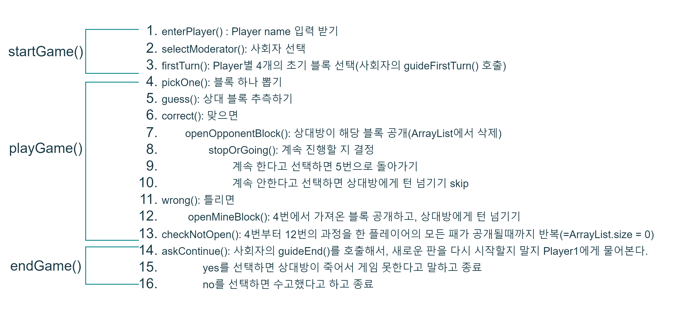

# backend-1st-goslingcode

 

## 고슬링코드

자바로 다빈치코드를 각색해서 만든 보드게임

 
 

## 규칙(2인게임)

- 흰 블록 12개, 검은 블록 12개(0~11)
- 왼쪽부터 오른쪽 순으로 오름차순 정렬
- 흰 블록과 검은 블록이 같은 숫자일 경우, 흰색이 왼쪽에 위치
- 첫 턴에 4개의 블록을 랜덤으로 선택한다.
- 본인 턴이 되면, 뽑히지 않은 남은 블록들 중 한 개를 선택하여 본인 게임판에 넣어 다시 정렬한다.
- 플레이어는 상대방의 블록 하나에 해당하는 숫자를 예측한다.
    - **맞을 경우** 상대방의 블록이 공개된다.
        - 이 경우에는 원한다면 계속 상대방의 패를 맞출 수 있다.
        - 계속 맞히던 중, 아무 때나 차례를 중단하고 상대방에게 넘길 수 있다.(승자의 권리!)
    - **틀릴 경우** 플레이어는 그 차례에 가져갔던 블록을 공개하고 턴이 상대방에게 넘어간다.
- 블록이 모두 공개된 사람은 패한다. 마지막까지 패가 남아 있는 사람이 승리한다.

 
 

## 구현하고자 한 기능 

 
 

## UML 

